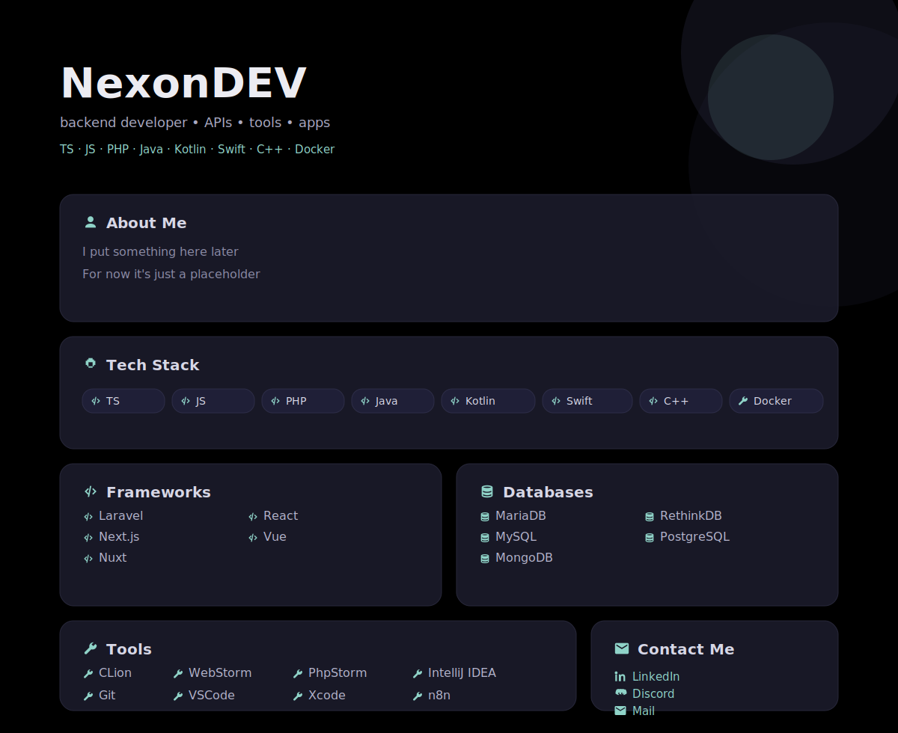

<!--
NexonDEV backend developer TypeScript JavaScript PHP Java Kotlin Swift C++ Docker
Laravel Next.js Nuxt React Vue
PostgreSQL MySQL MariaDB MongoDB RethinkDB
CLion WebStorm PhpStorm IntelliJ IDEA Git VSCode Xcode n8n
-->

<!-----

## Stats

-->
